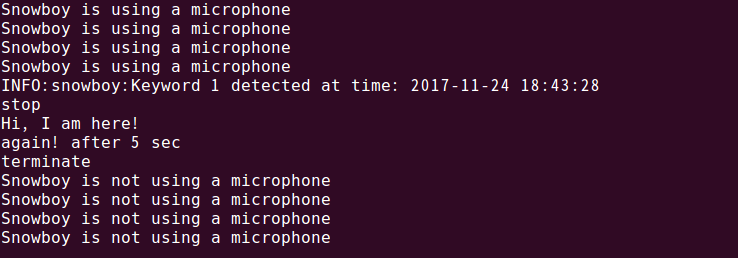

## snowboy_wrapper 
# This is a snowboy wrapped for easy use. 

Just use the <b>triggerword</b> Folder where you want to use it.
---
 
1. Support
==========
Machine 
------

>  armv7l - Support (Raspberry Pi2,3)  
   x86_64 - Support

python version 
------
>  python2.x - Support 
   python3.x - Support

 
2. requirement
==========
<pre>
<code>
$ sudo apt-get install swig
$ sudo apt-get install python-pyaudio python3-pyaudio sox
$ sudo apt-get install libatlas-base-dev
$ sudo apt-get install portaudio19-dev
$ sudo apt-get install python-dev
$ pip install pyaudio
</code>
</pre>

 
3. for Sample Test
==========
<pre>
<code>
$ python exmaple.py
</code>
</pre>

 
4. output
==========

 
5. explain for 'exmaple.py'
==========

<pre>
you can say 'snowboy'
then snowboy is stopped and displayed to  'Hi, I am here!'
snowboy will start again after 5sec.
</pre>
